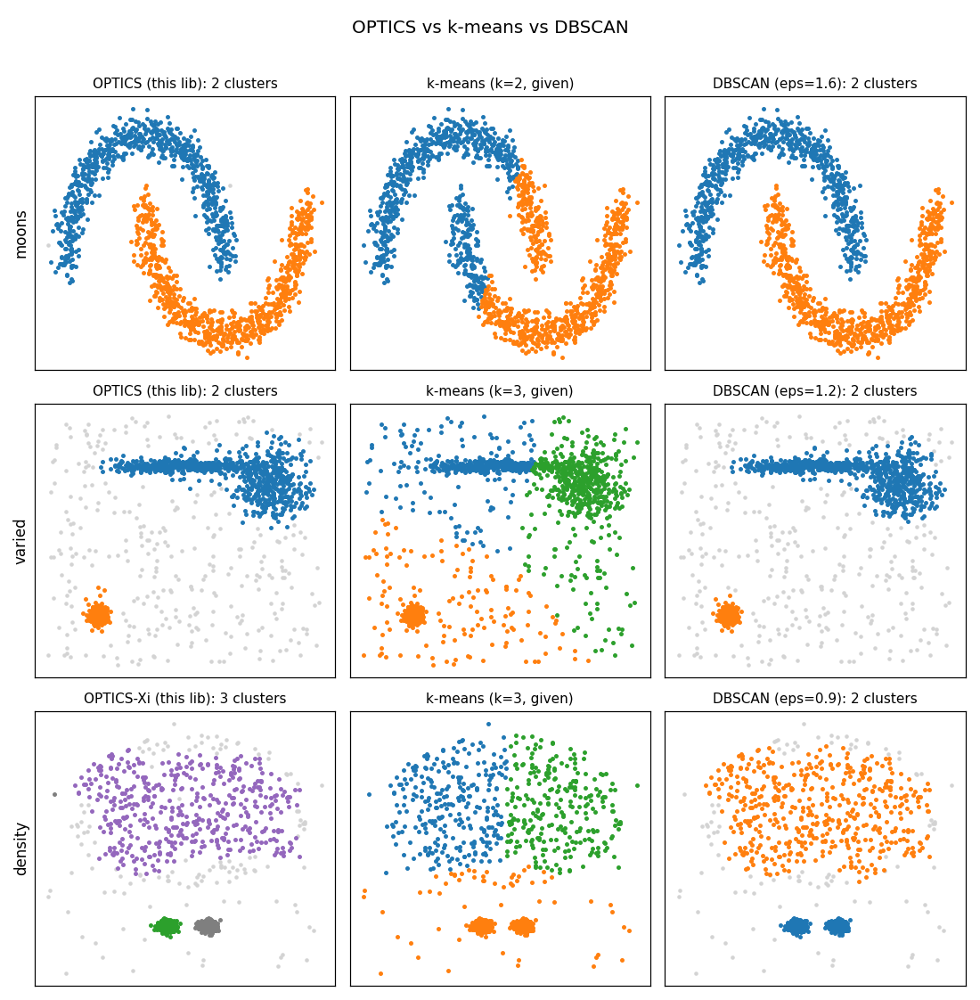
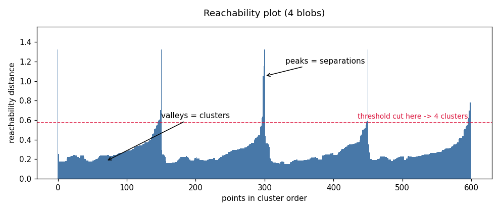

[](https://github.com/J-D-3/OPTICS-Clustering/actions/workflows/ci.yml)

# OPTICS-Clustering

**Ordering Points To Identify the Clustering Structure ([OPTICS](https://github.com/J-D-3/OPTICS-Clustering/blob/master/background/OPTICS.pdf))** is an algorithm for finding density-based clusters in spatial data, presented by Mihael Ankerst, Markus M. Breunig, Hans-Peter Kriegel and Jörg Sander in 1999.

## Introduction

This repository is a header-only **C++20** implementation of OPTICS. It provides an easy-to-use clustering algorithm that does not require knowing the number of clusters a priori, and that scales to large point clouds (millions of points). You can inspect the cluster structure visually (via a [reachability plot](https://github.com/J-D-3/OPTICS-Clustering/blob/master/resources/reachabilityplot.png)) and extract clusters either with a simple reachability threshold or with the hierarchical ξ (Xi) method.

For background on the algorithm see the [paper](https://github.com/J-D-3/OPTICS-Clustering/blob/master/background/OPTICS.pdf), [Wikipedia](https://en.wikipedia.org/wiki/OPTICS_algorithm), or [YouTube](https://www.youtube.com/watch?v=8kJjgowewOs).

## When to use OPTICS (vs k-means & DBSCAN)

OPTICS is a density-based clustering algorithm. It does **not** need the number of clusters up front, it finds arbitrarily-shaped clusters, it labels low-density points as noise, and — unlike DBSCAN — it does not commit to a single global density: one run produces a reachability *ordering* from which you can read clusters at multiple density scales (a flat threshold cut, or the hierarchical ξ method).



*Generated by `python tools/compare_algorithms.py` — OPTICS labels come from this library; k-means and DBSCAN from scikit-learn. On `moons`, k-means cuts across the crescents because it assumes convex, comparably-sized blobs, while OPTICS and DBSCAN recover the true shapes. On `varied`, k-means has no notion of noise and splits the elongated cluster, while the density methods isolate the structure and leave the sparse background as noise. On `density` — two tight clusters beside one sparse cluster — **no single DBSCAN `eps` works** (the radius that connects the sparse cluster also merges the dense pair, so DBSCAN collapses to two), and k-means ignores density entirely; only OPTICS, reading the reachability hierarchy with the ξ method, recovers all three. This is the case OPTICS is built for.*

| | needs *k*? | arbitrary shapes | noise | varying density | hierarchy | speed | deterministic |
|---|:---:|:---:|:---:|:---:|:---:|:---:|:---:|
| **k-means** | yes | no | no | no | no | very fast | no (random init) |
| **DBSCAN** | no | yes | yes | no (one global eps) | no | fast | yes |
| **OPTICS** | no | yes | yes | yes (ordering across scales) | yes (ξ) | slower (query-bound) | yes |

**Be honest about the trade-offs.** If your clusters are roughly convex and you know *k*, **k-means** is far faster and perfectly adequate. If a single density threshold separates your clusters, **DBSCAN** is simpler and quick. Reach for **OPTICS** when you don't know *k*, when clusters sit at *different* densities (where one DBSCAN `eps` can't win), or when you want to *see* the cluster hierarchy via the reachability plot before committing to a cut. OPTICS is the most general of the three — and the most expensive, its cost dominated by neighbor queries. You can independently sanity-check our results against scikit-learn's OPTICS with `tools/validate_sklearn.py`.

→ Quantitative runtime comparisons (this library's backends vs scikit-learn OPTICS, DBSCAN, and k-means, across sample sizes and dimensions) are in **[`perf/README.md`](perf/README.md)**.

## Quickstart: cluster your own data

You don't have to write any C++ to try it — build the bundled example and point it at a CSV (one numeric row per point, with a `x0,x1,...` header; extra trailing columns are ignored).

```sh
# 1. Build the example (MSVC shown; use linux-gcc / linux-clang on Linux/macOS)
cmake --preset msvc
cmake --build --preset msvc --target cluster_csv
python tools/datasets.py --name moons --n 1500 --out data/moons.csv   # or bring your own CSV

# 2. Cluster it  ->  writes <out>_points.csv (labels) and <out>_reach.csv (the plot)
build/examples/Release/cluster_csv data/moons.csv data/moons 10        # 10 = min_pts

# 3. See it
python tools/visualize.py --points data/moons_points.csv --reach data/moons_reach.csv
```

On Linux/macOS the binary is `build/examples/cluster_csv`. Python deps for the tools: `pip install -r requirements.txt`. See [`examples/cluster_csv/README.md`](examples/cluster_csv/README.md) for all options, and **Reading the reachability plot** / **Choosing parameters** below.

## Usage

A point is a `std::array<T, Dim>` of Cartesian coordinates (`T` is `float` or `double`); a cloud is a `std::vector` of those.

```cpp
#include <optics/optics.hpp>
#include <array>
#include <vector>

using Point = std::array<double, 2>;

int main() {
    std::vector<Point> points = /* your data */;

    // The OPTICS cluster-ordering + reachability distances.
    auto reach = optics::compute_reachability_dists(points, /*min_pts=*/10);

    // Flat clusters by a reachability threshold ...
    auto clusters = optics::get_cluster_indices(reach, /*threshold=*/2.0);

    // ... or the hierarchical Xi method (nested cluster trees).
    auto trees = optics::get_chi_clusters(reach, /*chi=*/0.05, /*min_pts=*/10);
}
```

The full signature lets you choose the backend, neighbor-acquisition strategy, and thread count:

```cpp
optics::compute_reachability_dists<T, Dim, Backend>(
    points, min_pts,
    epsilon  = -1.0,                       // auto-estimated when <= 0
    mode     = optics::NeighborMode::OnDemand,  // default; Precompute is the parallel, opt-in cache
    n_threads = 0);                        // threads for Precompute only (0 => hardware concurrency)
```

### Convenience helpers

- `optics::cluster_dbscan(points, min_pts, threshold)` — compute the ordering and cut at a threshold in one call (returns one index list per cluster).
- `optics::extract_xi(reach_dists, chi, min_pts)` — Xi (steep-area) clusters as point-index lists.
- `optics::convert_cloud<float>(int_points)` — convert an integer/byte cloud (e.g. `uint8` color data) to a floating-point cloud, since `T` must be `float`/`double`.

### Python (optional binding)

An optional [pybind11](https://pybind11.readthedocs.io/) binding exposes OPTICS for **1/2/3/4-D NumPy** clouds (off by default; the C++ library stays dependency-free):

```python
import numpy as np, optics_py
labels = optics_py.cluster_dbscan(pts, min_pts=10, threshold=2.0)   # (N, Dim) -> per-point labels
labels_xi = optics_py.extract_xi(pts, min_pts=10, chi=0.05)
```

Build + usage in **[`python/README.md`](python/README.md)**. For data already on disk, the `cluster_csv` example + `tools/visualize.py` need no binding at all.

### Visualizing results

The core writes no images; export CSV and render with the bundled script (matplotlib):

```cpp
#include <optics/io.hpp>
auto labels = optics::io::cluster_labels(points.size(), clusters);
optics::io::export_points_csv("points.csv", points, labels);   // any dimension
optics::io::export_reachability_csv("reach.csv", reach);
```

```sh
python tools/visualize.py --points points.csv --reach reach.csv --out plot.png
```

`visualize.py` handles 2D and 3D scatter (e.g. color spaces) and falls back to a PCA projection for higher dimensions.

## Reading the reachability plot

OPTICS doesn't hand you clusters directly — it produces a *reachability plot*: the points laid out in cluster-order, each bar its reachability distance. Read it like a landscape.



- **Valleys** (runs of low bars) are clusters — points packed densely together.
- **Peaks** (tall bars) are the jumps *between* clusters, or sparse/noise points.
- A **horizontal cut** at some height is exactly the flat `get_cluster_indices(reach, threshold)` extraction: every valley dipping below the line becomes a cluster. The hierarchical ξ method (`get_chi_clusters` / `extract_xi`) instead follows the valley walls, so it can pull out clusters that sit at *different* depths — the case a single horizontal cut (or a single DBSCAN `eps`) cannot capture.

## Choosing parameters

- **`min_pts`** (required) — how many neighbors make a point "core". Higher values smooth the plot and ignore small/noisy groups; lower values are more sensitive. A common starting point is `2 × dim` to `~20`; raise it if the plot is jagged, lower it if real small clusters get swallowed.
- **`epsilon`** (optional, auto-estimated when `≤ 0`) — the largest neighborhood radius considered. It mainly bounds cost and memory: large enough captures all structure; too small truncates the plot (UNDEFINED reachability, shown as full-height bars). Leave it auto unless you need to cap work on huge clouds.
- **`threshold`** (flat cut) — the reachability height at which valleys become clusters. Pick it by *looking at the plot*: just under the valley floors you care about. Smaller → tighter, more clusters; larger → fewer, looser clusters.
- **`chi`** (ξ method) — relative steepness (e.g. `0.05`) that delimits a cluster's walls. Use ξ instead of a flat threshold when clusters live at different densities.

For domain-specific tuning and gotchas on image/color data (flat-color regions, `eps` in RGB units, separating anti-aliasing/JPEG "bridge" colors), see **[`examples/color_clustering/README.md`](examples/color_clustering/README.md)**.

## Performance

OPTICS comfortably handles **millions** of low-dimensional points (~6 s for 1e6 3-D points on a 22-thread desktop). Cost is dominated by neighbor queries, so it is **query-bound** and high dimensionality is expensive (the curse of dimensionality). On *dense* data (e.g. flat-color images) neighborhoods grow with n and the ordering tends toward **O(n²)** in both time and memory — keep `epsilon` modest, use `OnDemand` mode, or downsample. On identical clouds this library is **one to three orders of magnitude faster than scikit-learn's OPTICS**, and competitive with scikit-learn's DBSCAN, while k-means (no neighbor graph) remains the cheapest per run.

Tuning knobs: **`OnDemand`** (the default — lean memory, and faster on dense clouds) vs **`Precompute`** (opt-in parallel cache, faster on sparse/low-density clouds but O(n × neighbors) memory); the thread count (Precompute only); and the backend — exact `NanoflannBackend`, `ApproxNanoflannBackend` (helps only in high dimensions, where search — not neighborhood processing — dominates), or the optional Boost R\*-tree.

→ **Full performance analysis** — committed baselines, scaling by sample size, per-backend and scikit-learn/DBSCAN/k-means comparisons (incl. real images), and *why the approximate backend helps only in high dimensions* — is in **[`perf/README.md`](perf/README.md)**.

## Documentation

- **[`perf/README.md`](perf/README.md)** — performance: benchmarks, scaling, backend & cross-library comparisons, the approximate-backend analysis.
- **[`examples/cluster_csv/README.md`](examples/cluster_csv/README.md)** — cluster your own CSV (2/3/4/16-D), all options.
- **[`examples/color_clustering/README.md`](examples/color_clustering/README.md)** — the color-space guide: image pipeline, output modes, color parameter tips, and gotchas.
- **[`python/README.md`](python/README.md)** — the optional NumPy (pybind11) binding.
- **[`tools/README.md`](tools/README.md)** — visualization, dataset generators, and comparison/validation scripts.
- **[`docs/ROADMAP-0.9.1.md`](docs/ROADMAP-0.9.1.md)** — the current milestone plan; **[`docs/ROADMAP-post-0.9.1.md`](docs/ROADMAP-post-0.9.1.md)** — the lookahead toward 1.0.0.

## Dependencies

None required: [nanoflann](https://github.com/jlblancoc/nanoflann) (BSD 2-Clause) is vendored under `include/optics/`, and everything else is the C++ standard library. **Boost** is an optional alternative neighbor-search backend, enabled with `-DOPTICS_ENABLE_BOOST_RTREE=ON`. Bundled third-party licenses are listed in [`THIRD-PARTY-LICENSES.md`](THIRD-PARTY-LICENSES.md).

## Building & testing

Header-only — just add `include/` to your include path and `#include <optics/optics.hpp>`. To build the tests/benchmark (CMake ≥ 3.21, MSVC 2022 / GCC 10+ / Clang 13+):

```sh
cmake --preset linux-gcc      # or: linux-clang, msvc
cmake --build --preset linux-gcc
ctest --preset linux-gcc
```

## License

Distributed under the MIT Software License (X11 license). (See accompanying file LICENSE.) Bundled third-party components and their licenses are listed in [`THIRD-PARTY-LICENSES.md`](THIRD-PARTY-LICENSES.md).
