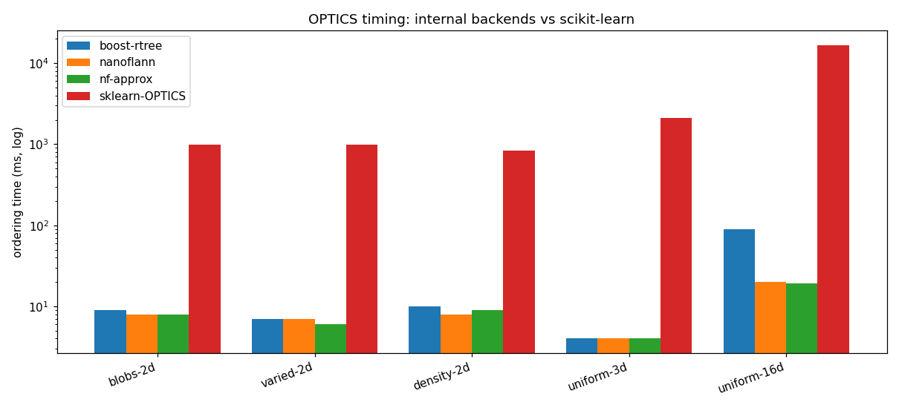
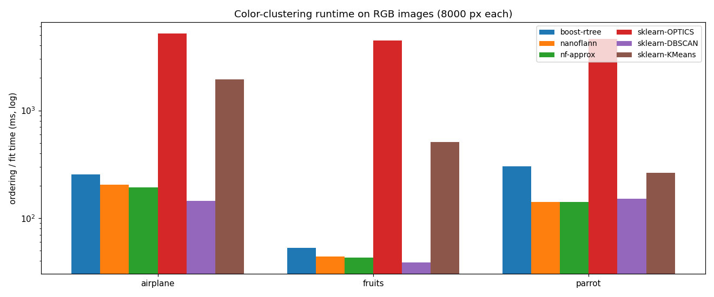

# Performance tracking

`optics_perf` (built from `test/Benchmark/perf.cpp`, nanobench) measures the hot paths and a
few end-to-end ordering scenarios, and writes `optics_perf.csv`. Use it to quantify the impact
of the Tier-0 performance work (see `docs/ROADMAP-0.9.md`).

## Running

```sh
cmake --build build --config Release --target optics_perf
./build/test/Release/optics_perf      # writes optics_perf.csv in the working dir
```

**Threads.** All timing harnesses (`optics_perf`, `optics_benchmark`, `optics_scale`) default
to **4 worker threads** so numbers are reproducible and comparable across machines instead of
scaling with the dev box's core count. Override with the `OPTICS_BENCH_THREADS` environment
variable (e.g. `OPTICS_BENCH_THREADS=16`). For the memory-bound precompute phase, 4 threads is
often *faster* than saturating all cores.

## `baseline.csv`

Committed reference for the current line of development (refreshed for v0.9.1).

- Machine: 22-thread desktop (Windows, MSVC 19.44, Release).
- Headline metric for #12: **`core_dist 3D double (30k)`** (per-call ns, `elapsed` column ÷ batch).

### v0.9.1 scenarios

- **`dense 3D 30k core-dist {scan,knn}`** — a few very dense blobs (flat-color-like), so
  each point's eps-neighborhood is huge. The Knn core-distance (issue #24) avoids scanning
  the neighborhood and is faster here (~2.9 s → ~2.4 s, ≈16% at 4 threads); the gap widens as
  neighborhoods grow.
- **`backend 16D 8k nanoflann {exact,approx}`** (plus `boost rtree` when built with
  `-DOPTICS_ENABLE_BOOST_RTREE=ON`) — the same 16-D cloud across backends, comparing the
  exact KD-tree, the eps-approximate backend (issue #28), and Boost's R*-tree.

## How to compare (important)

This is a noisy multi-core desktop: run-to-run variation on the microbenchmarks can reach
~30%, larger than the intra-run `error %`. So **do not** compare a fresh run against a
days-old `baseline.csv` and trust small deltas. Instead, for each essential change:

1. Build + run `optics_perf` on the parent commit, save the CSV.
2. Build + run on the change, save the CSV.
3. Compare the two **back-to-back** runs; treat only changes clearly above the run-to-run
   noise (rule of thumb: > ~15–20% on the microbenchmarks) as signal.

Refresh `baseline.csv` after each landed Tier-0 change so it tracks the current best.
CI may run `optics_perf` informationally, but timings are **not** a gate (runner hardware
varies).

## Large-scale validation (`optics_scale`)

`optics_scale [n]` times the 3D color-space-style workload (uniform cloud, min_pts=16) at
1e6–1e7 points. The figures below are indicative, captured on a 22-thread desktop (Release) at
full hardware concurrency; the harness now defaults to 4 threads (override with
`OPTICS_BENCH_THREADS`), so Precompute timings on the same box will differ:

| workload      | Precompute       | OnDemand (x1) |
|---------------|------------------|---------------|
| 3D float  1e6 | ~5.8 s           | ~7.8 s        |
| 3D double 1e6 | ~6.7 s           | ~9.3 s        |
| 3D float  1e7 | ~44.0 s          | ~52.0 s       |
| 3D double 1e7 | ~45.7 s          | ~55.7 s       |

Both modes order the full cloud; Precompute did not OOM at 1e7 on the desktop. Note the modest
Precompute-vs-OnDemand gap at 1e7: the sequential ordering loop is a large fraction at this
scale, so parallelizing only the query phase is Amdahl-limited. Confirms the Tier-0 finding that
OPTICS is **query-bound** — future speedups live in the query path (backend, approximate-NN),
not the surrounding bookkeeping.

## Backends vs scikit-learn — synthetic cases (`tools/timing_compare.py`)

Ordering time of the internal backends — exact nanoflann, the approximate backend, and (when built
with `-DOPTICS_ENABLE_BOOST_RTREE=ON`) Boost's R\*-tree — against `sklearn.cluster.OPTICS` on shared
2-D/3-D/16-D clouds, all internal timings at 4 threads. This library is one to three orders of
magnitude faster than scikit-learn's OPTICS; Boost's R\*-tree degrades in 16-D where nanoflann holds
up; the approximate backend matches exact here (see the analysis at the end of this file).

```sh
python tools/timing_compare.py --exe build/test/Release/optics_backend_compare
```



## Real-world: color clustering on RGB images (`tools/timing_images.py`)

Runtime of color clustering (RGB in 3-D) on three standard test images, 8000 pixels sampled per
image into the *same* cloud for every method (so scikit-learn's OPTICS stays tractable),
`min_pts=10`, our backends at 4 threads. k-means is shown at both `n_init=1` (one Lloyd run) and
`n_init=10` (its quality default):

| image (8000 px) | nanoflann | nf-approx | boost-rtree | sklearn-OPTICS | sklearn-DBSCAN | kmeans(1) | kmeans(10) |
|-----------------|-----------|-----------|-------------|----------------|----------------|-----------|------------|
| airplane        | 247 ms    | 200 ms    | 253 ms      | 5005 ms        | 153 ms         | 109 ms    | 660 ms     |
| fruits          |  44 ms    |  46 ms    |  52 ms      | 4526 ms        |  39 ms         |  29 ms    | 361 ms     |
| parrot          | 146 ms    | 140 ms    | 334 ms      | 4660 ms        | 147 ms         |  20 ms    | 292 ms     |

Takeaways:
- vs **scikit-learn's OPTICS** (same algorithm): our ordering is **~20–100× faster** on the
  identical cloud; the gap widens with the pixel budget.
- **k-means is the cheapest per run** — it has no neighbor graph, just Lloyd iterations. A single
  run (`kmeans(1)`) is often faster than our OPTICS (e.g. parrot 20 ms vs 146 ms). OPTICS's value
  over k-means is *what it computes* (automatic cluster count, noise, arbitrary shapes, the full
  hierarchy), **not speed**. k-means's quality default `n_init=10` does 10 restarts and is the
  slower bar.
- Our OPTICS sits in scikit-learn's **DBSCAN** band while computing the full ordering + hierarchy,
  not just flat labels.
- The approximate backend matches exact in 3-D (its payoff is in high dimensions); Boost's
  R\*-tree trails nanoflann. Reproduce:

```sh
# harness built with -DOPTICS_ENABLE_BOOST_RTREE=ON to include the Boost row
python tools/timing_images.py --exe build-boost/test/Release/optics_backend_compare \
    --images airplane.ppm fruits.ppm parrot.ppm --n 8000 --plot ../docs/img/timing_images.png
```



### Scaling with sample size (3-D color, auto-ε)

`parrot.ppm` sampled at increasing pixel counts, `min_pts=10`, our backends @ 4 threads. With
auto-ε the **average neighborhood grows with n** (a denser color space), so every density method
is effectively ~O(n²) here, and Precompute memory is ~O(n²) too:

| n (px)   | avg neighbors | nanoflann | approx(0.1) | sklearn-OPTICS | sklearn-DBSCAN | kmeans(1) |
|----------|---------------|-----------|-------------|----------------|----------------|-----------|
| 800      | 203           | 3 ms      | 2 ms        | 478 ms         | 6 ms           | 11 ms     |
| 8 000    | 1 962         | 142 ms    | 141 ms      | 5 405 ms       | 205 ms         | 18 ms     |
| 80 000   | 18 940        | 18 514 ms | 19 535 ms   | *(skipped)*    | 25 478 ms      | 63 ms     |
| 100 000  | 23 461        | 32 125 ms | 33 617 ms   | *(skipped)*    | 49 426 ms      | 92 ms     |

100 000 px is about the **edge of feasibility for Precompute** on this 32 GB box: the neighbor lists
are n × avg_nbrs × 8 B ≈ **18.8 GB**; 120 k would need ≈ 27 GB and OOMs. Above this, switch to
`OnDemand` mode (lean memory, no O(n²) buffer) or a smaller ε. scikit-learn's OPTICS is skipped
above 8 k (it is also ~O(n²) and would take many minutes).

- The average neighborhood grows ~linearly with n, so our OPTICS, scikit-learn's OPTICS, and
  scikit-learn's DBSCAN are all ~**O(n²)** in this regime. Our OPTICS stays ~40–160× faster than
  scikit-learn's OPTICS and, by 100 k, **overtakes scikit-learn's DBSCAN** (32 s vs 49 s) while
  computing the full ordering + hierarchy — but the asymptotics are identical.
- **k-means is the only near-linear method** (92 ms at 100 k) and the only one that scales much
  further comfortably.
- For large color clouds, use a **smaller ε** (tighter color clusters), **OnDemand** mode (lean
  memory, avoids the O(n²) buffer, *and faster on dense clouds* — see below), **deduplicate**
  (see next section — the biggest single win for images), or **downsample** — not a different backend.

### Deduplication / unique-point OPTICS (`optics_dedup_probe`, #46)

The dense-color O(n²) comes from flat regions where the *same* RGB triple repeats thousands of
times — each repeat carries no new information yet pays full ordering cost. `deduplicate()` collapses
identical pixels to unique points with integer weights; weight-aware OPTICS on the small unique cloud
gives the **same** partition (lossless) and is now the default in `cluster_threshold` / `extract_xi`.

Both images at `--max-dim 360`, `min_pts=25`, same ε on both paths, OnDemand, 1 thread:

| image  | n (px) | unique | collapse | full ordering | dedup + weighted | **speedup** |
|--------|--------|--------|----------|---------------|------------------|-------------|
| parrot | 86 400 | 23 739 | 3.6×     | 18 148 ms     | 11 + 447 ms      | **≈ 40×**   |
| hexal  | 50 400 |  8 876 | 5.7×     |  7 731 ms     |  5 + 318 ms      | **≈ 24×**   |

The **speedup (24–40×) far exceeds the point-collapse (3.6–5.7×)**: dedup removes a flat region's
whole O(region²) ordering term, not just its point count, so it attacks the quadratic directly. The
deduplication pass itself is ~negligible (5–11 ms). On JPEGs (hexal) exact dedup is limited by
DCT/gradient artifacts; `quantize(points, bin)` first (lossy) pushes the collapse ~3–4× further
(≈33× at `bin=4`). Reproduce: `optics_dedup_probe parrot_rgb.csv hexal_rgb.csv 25`.

### Precompute vs OnDemand (`optics_mode_compare`)

`Precompute` caches every point's ε-neighborhood up front, in parallel — **O(n × avg_nbrs) memory**.
`OnDemand` queries one neighborhood at a time during the (sequential) ordering — **O(one
neighborhood) memory**. On the dense color clouds above (parrot, auto-ε, 4 threads for Precompute):

| n        | avg nbrs | Precompute buffer | Precompute | OnDemand |
|----------|----------|-------------------|------------|----------|
| 8 000    | 1 962    | 0.13 GB           | 170 ms     | 146 ms   |
| 80 000   | 19 258   | 12.3 GB           | 19.5 s     | **13.7 s** |
| 100 000  | 23 378   | 18.7 GB           | 30.7 s     | **20.6 s** |
| 200 000  | 46 979   | 75.2 GB           | *OOM — skipped* | **87.9 s** |

- **OnDemand scales past the Precompute memory wall.** Its footprint is ~O(one neighborhood) plus
  the points/tree (tens of MB at 200 k), *not* the O(n × avg_nbrs) buffer — so it clusters the 200 k
  cloud whose Precompute buffer would need **75 GB**. Memory stops being the limit; time (still
  ~O(n²) on dense color) becomes it.
- **On dense clouds OnDemand is also ~30% _faster_**, despite giving up the parallel precompute and
  re-querying sequentially: materializing and then re-reading the 12–19 GB neighbor cache costs more
  memory bandwidth than re-querying each neighborhood into a small, hot, reused buffer. The
  parallel-precompute win only pays off when neighborhoods are **small** — on the sparse/uniform
  `optics_scale` clouds above, Precompute is the faster mode.

**Rule of thumb: Precompute for sparse / low-density clouds; OnDemand for dense clouds and for any
cloud too large to cache.** Because OnDemand is the safer choice (never OOMs) and wins on the dense
workloads this library targets, it is the **default mode since v0.9.1**; pass
`NeighborMode::Precompute` to opt into the parallel cache. Reproduce:
`optics_mode_compare parrot_8000.csv parrot_200000.csv 10 cap=19`.

### Why the approximate backend rarely beats exact (`optics_approx_probe`)

`optics_approx_probe` reports, per cloud, the exact and approximate ordering time plus the
**neighbor recall** (the fraction of the exact ε-neighbors the approximate search still returns).
Recall ≈ 1.0 means the approximate search did the *same work*, so it cannot be faster:

3-D color (`parrot`, 8 000 px, avg neighbors ≈ 1 962):

| backend        | order | recall |
|----------------|-------|--------|
| exact          | 142 ms | 1.000 |
| approx ε=0.1   | 141 ms | 0.997 |
| approx ε=0.5   | 145 ms | 0.966 |
| approx ε=1.0   | 140 ms | 0.931 |

16-D uniform (8 000 pts, avg neighbors ≈ 2):

| backend        | order | recall |
|----------------|-------|--------|
| exact          | 104 ms | 1.000 |
| approx ε=0.1   |  93 ms | 1.000 |
| approx ε=0.5   |  71 ms | 1.000 |
| approx ε=1.0   |  44 ms | 1.000 |

Two independent reasons the approximate backend doesn't help on 3-D color, and one regime where it
does:

1. **Low dimension prunes almost nothing.** nanoflann's ε-approximation skips KD-tree branches whose
   nearest corner is within a thin shell of the query radius. In 3-D that shell is a negligible
   slice of the tree, so even ε=1.0 still returns 93–100% of neighbors (recall barely drops) — there
   is nothing to save, and the extra pruning check can even make it marginally *slower*.
2. **3-D color is neighborhood-bound, not search-bound.** With huge neighborhoods (≈2 000 at 8 k,
   ≈19 000 at 80 k), the time is dominated by *processing* each neighborhood — `compute_core_dist`'s
   scan and the relax loop, both O(|neighbors|) — which **no neighbor-search backend touches**. The
   query is a small slice of the total.
3. **High dimension is search-bound, and there approx wins.** In 16-D the neighborhoods are tiny
   (≈2) so the *tree traversal* dominates; the curse of dimensionality makes exact search visit many
   nodes, and ε-pruning cuts that traversal — **2.4× at ε=1.0** — while still returning every real
   neighbor (recall 1.0). This is exactly the 16-D regime `ApproxNanoflannBackend` was built for.

So the approximate backend is a **high-dimensional, search-bound** tool. Its default ε (0.1) is
conservative; raise `ApproxEpsPermille` (e.g. 500–1000) to trade recall for speed where the search —
not the neighborhood processing — is the bottleneck.

Reproduce (any numeric CSV with an `x0,x1,...` header; a 3-D color cloud and a 16-D cloud show the
contrast):

```sh
cmake --build build --config Release --target optics_approx_probe
./build/test/Release/optics_approx_probe color3d.csv uniform16d.csv 10
```

### sOPTICS projections: Gaussian vs structured/FHT (`optics_soptics_proj_probe`, #58)

sOPTICS's CEOs step projects every point onto `D` random vectors. The default **Gaussian** backend
dots each point with `D` explicit `N(0,1)` vectors — `O(D·Dim)` per point, computed on the fly. The
opt-in **structured** backend uses FHT "spinners" (`x → H D₃ H D₂ H D₁ x`) — `O(D·log Dim)` per
point — but must materialize the `n×D` projection table. Whether that pays depends on dimension
(normalized blobs, `D=1024`, `n≈9 600`, Rand vs exact OPTICS):

| Dim | exact OPTICS | Gaussian sOPTICS (Rand) | structured sOPTICS (Rand) | structured speedup |
|-----|--------------|-------------------------|---------------------------|--------------------|
| 3   |   355 ms     | 310 ms (1.00)           | 225 ms (**0.88**)         | faster, recall dip |
| 16  |   411 ms     | 421 ms (1.00)           | 512 ms (1.00)             | ~1.2× **slower**   |
| 64  |   840 ms     | 745 ms (1.00)           | 629 ms (1.00)             | ~1.2× faster       |
| 128 | 1 840 ms     | 818 ms (1.00)           | 590 ms (1.00)             | ~1.4× faster       |

**Finding (corrects the issue-#58 premise).** FHT spinners help the **high-dimensional** regime
(≥ ~64-D: ~1.2–1.4× faster at equal recall), *not* the low-dim small-`n` crossover. At low `Dim` the
Gaussian `O(D·Dim)` dot product is already cheap, so the structured path's `n×D` materialization and
memory traffic make it break-even (16-D) or worse; and at 3-D the Hadamard block (`next_pow2(3)=4`)
is so small that the spinners are too correlated and recall drops to ~0.88. So **the default stays
Gaussian**; pass `SopticsProjection::Structured` only for genuinely high-dimensional data (where it
compounds sOPTICS's existing high-D win over exact OPTICS — 590 ms vs 1 840 ms at 128-D). Reproduce:
`optics_soptics_proj_probe [scale]`.
